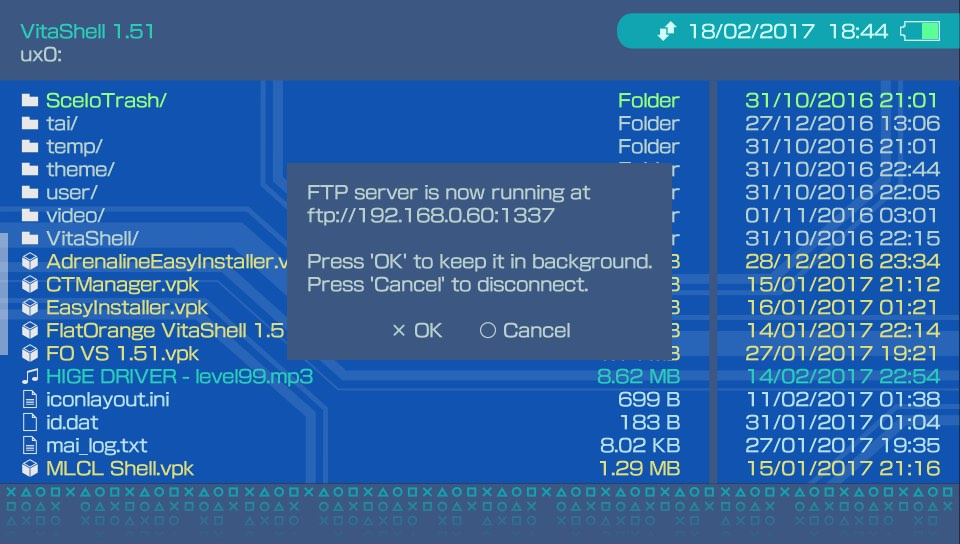
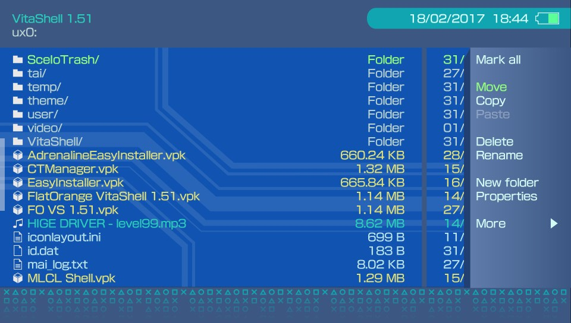
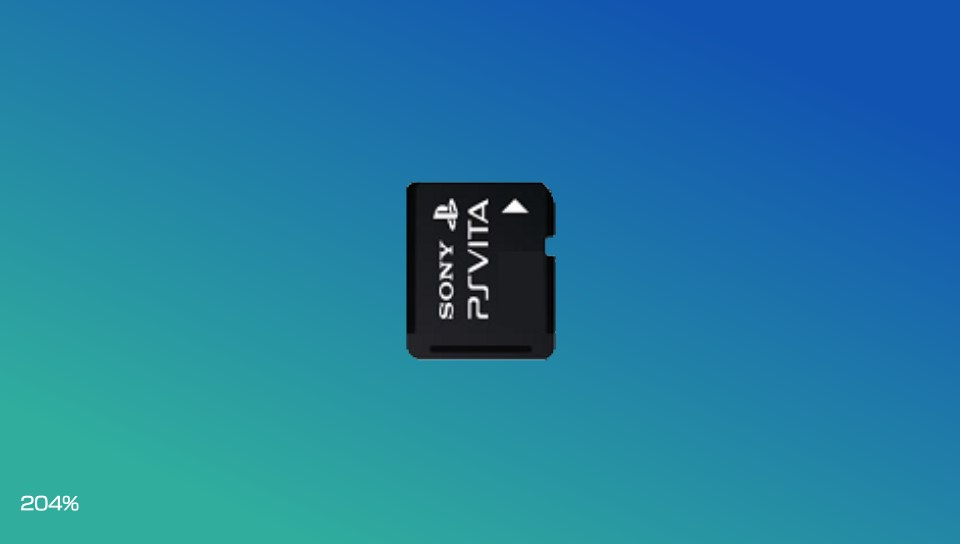

# Cobalt
## A VitaShell Theme

This is my second entry to theFlow's VitaShell default theme contest. [Link](http://wololo.net/talk/viewtopic.php?f=116&t=47830&sid=8b890dbb3668cc097cb76f8f8ed849c8)

Based on the first iteration of Cobalt theme, this is a tweaked darker version. Features the same consistency as Cobalt with some cosmetic changes and darker shades, all while keeping some blue in it. 

## Previews

File Browser & FTP

Context Menu

Context Menu More

Text Editor

Hex Editor

Music Player with Cover

Music Player no Cover

Image Viewer

*(obviously, the music visualizer is static)*

## Installation

Simply copy the "Cobalt Dark" folder into `ux0:/VitaShell/theme/` and make sure to modify `theme.txt` (in the former directory) to point to the new theme. This is done by changing `THEME_NAME = "Old_theme"` to `THEME_NAME = "Cobalt Dark"`

Thanks for stopping by and Enjoy :)

