# Electron Sky
## A VitaShell Theme

*(See Electron Theme folder for a general description)*

Electron Sky is a brighter version of the Electron theme, featuring the same design as the original theme and an adjusted color scheme favoring brighter colors. Like Electron, Sky is the results of many experiments and tests. The design was tweaked to fit the bright setting. 

Electron Sky needs to be installed to be fully appreciated :)

## Previews

Home

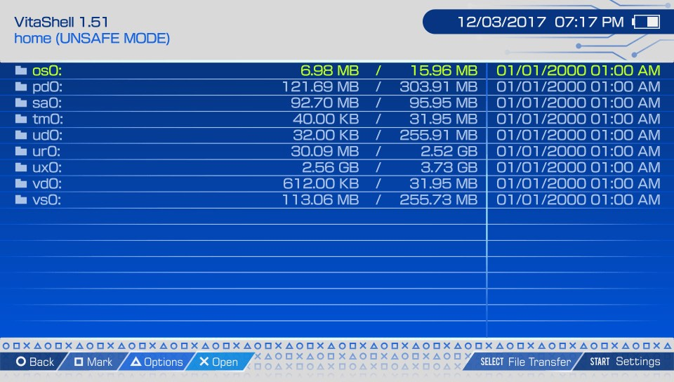

File Browser

Settings

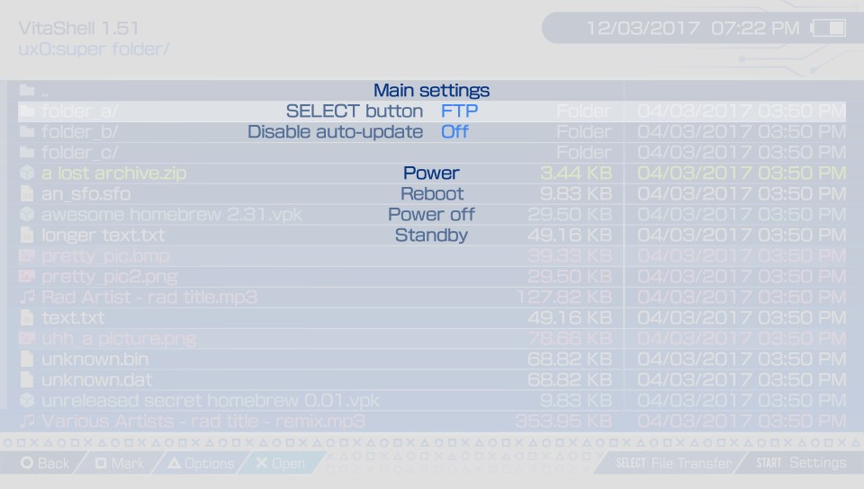

Dialog

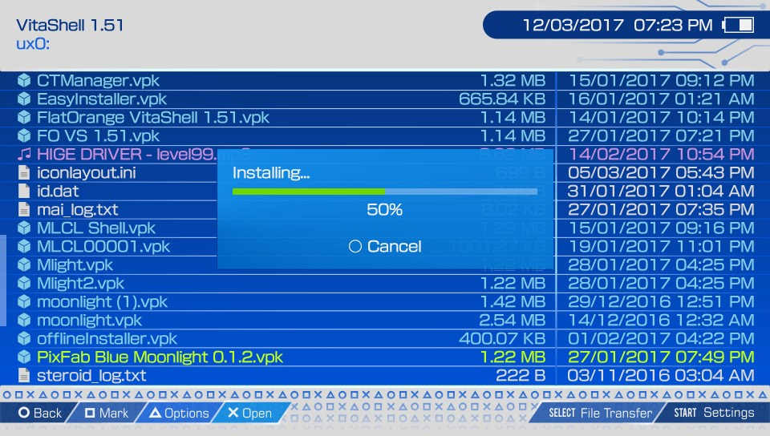

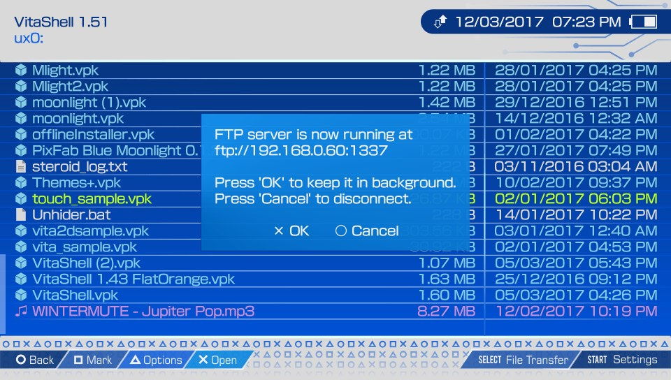

Context Menu

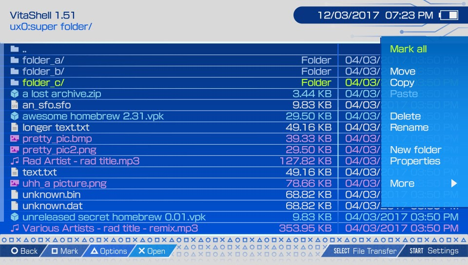

Context Menu More

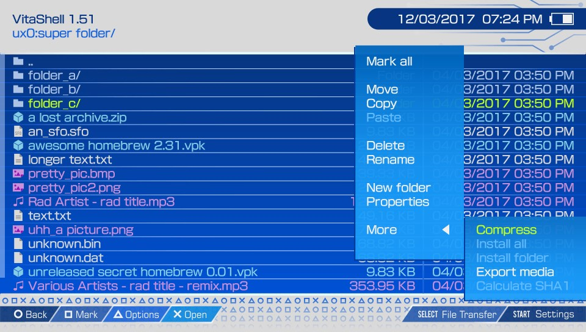

Text Editor (Battery Charging)

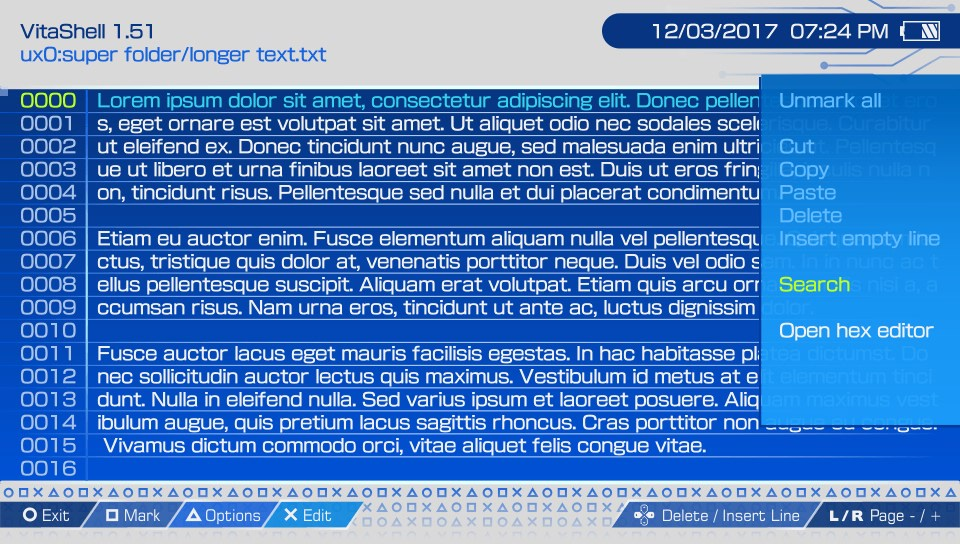

Hex Editor (Battery Charging)

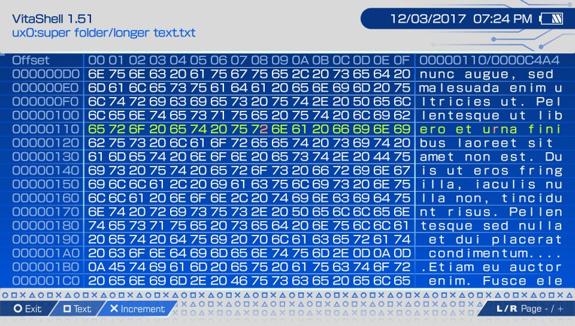

Music Player with Cover (Battery Charging)

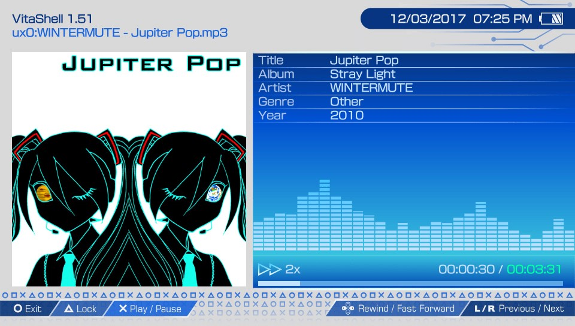

Music Player no Cover (Battery Charging)

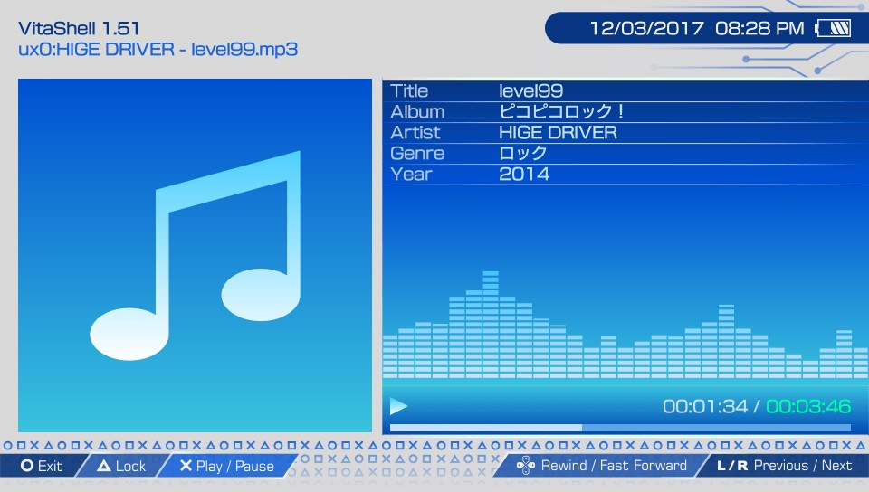

Image Viewer (Image is blurry because of the zoom)

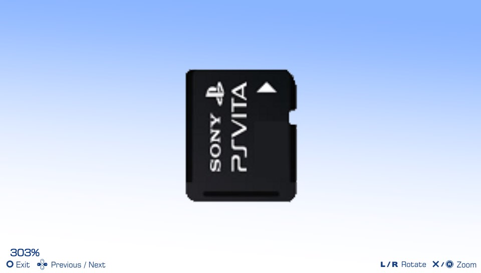

*(obviously, the music visualizer is static)*

## Installation

Simply copy the Electron Sky folder into `ux0:/VitaShell/theme/` and make sure to modify `theme.txt` (in the former directory) to point to the new theme. This is done by changing `THEME_NAME = "Old_theme"` to `THEME_NAME = "Electron Sky"`

Thanks for stopping by and Enjoy :)

## Bonus : LiveArea Theme

A little gift to go with Electron Sky theme, a compatible LiveArea theme.

Preview

Bubble

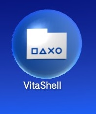

## Installation

Simply FTP into your vita and copy the contents of LiveArea folder into `ur0:/appmeta/VITASHELL` (make sure it's ur0 and not ux0) while saying 'yes' to any overwrite prompt.