# Electron
## A VitaShell Theme

This one is rather different. Inspired by the flow of electrons through electronic circuitry, this theme leans heavily on darker blues with a touch of brighter greens and blue-greens. Every view / visual component of this theme was meticulously designed to fall in line with the general idea of the theme. Extra effort was made to keep colors balanced and the design unobtrusive. Many possible color combinations were tested and many shape and form experimentations were performed to finally settle on the theme you see here. From battery icon to fast forward icon, every icon was redesigned to fit.

This theme took more time and effort than I had imagined for a VitaShell theme. Trust me on this, screenshots won't do it justice, install it and see for yourself. :)

## Previews

Home

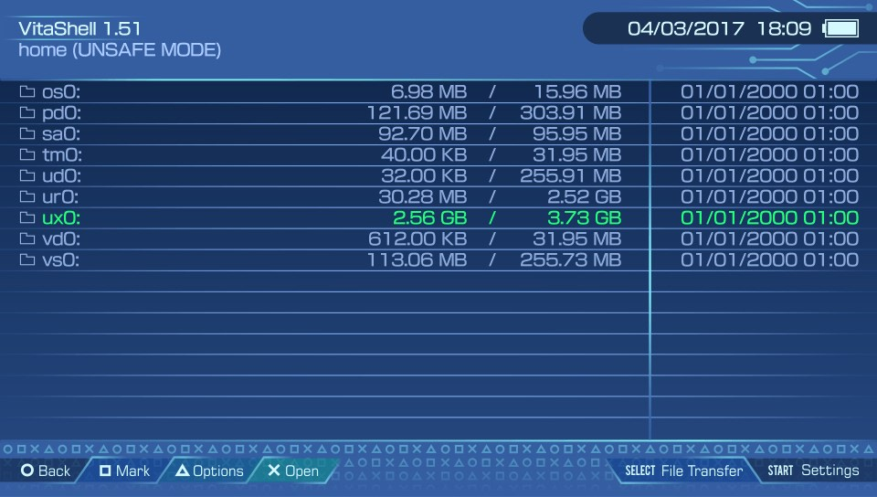

File Browser

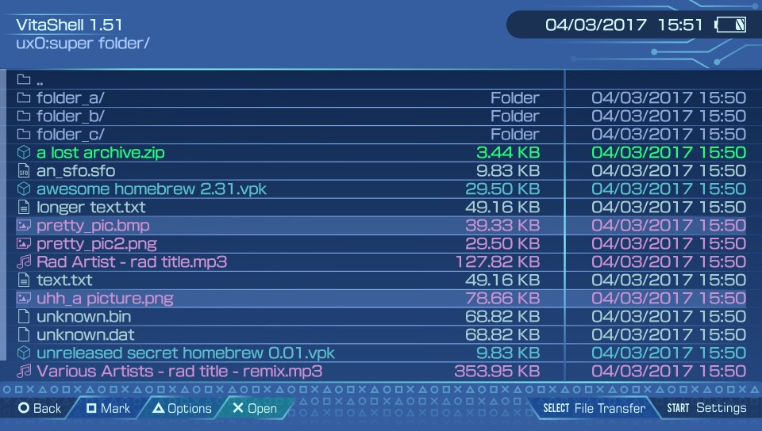

Settings

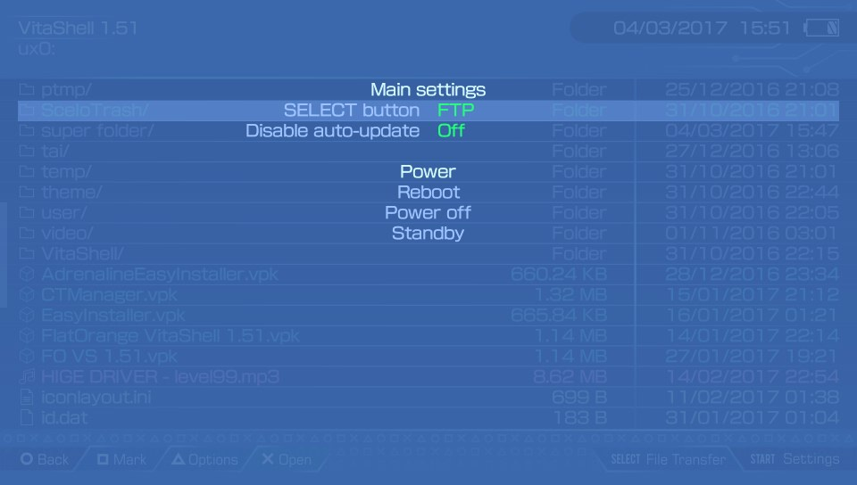

Dialog

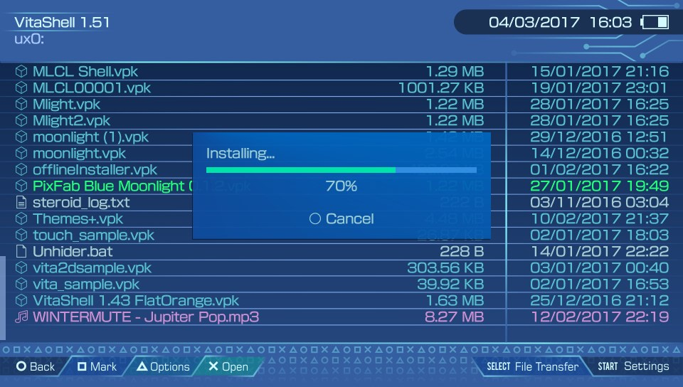

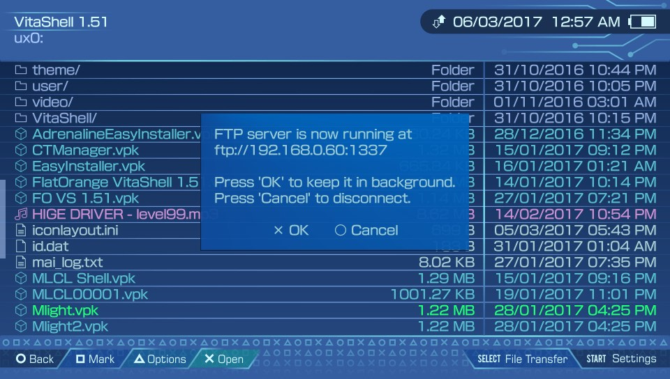

Context Menu (battery charging)

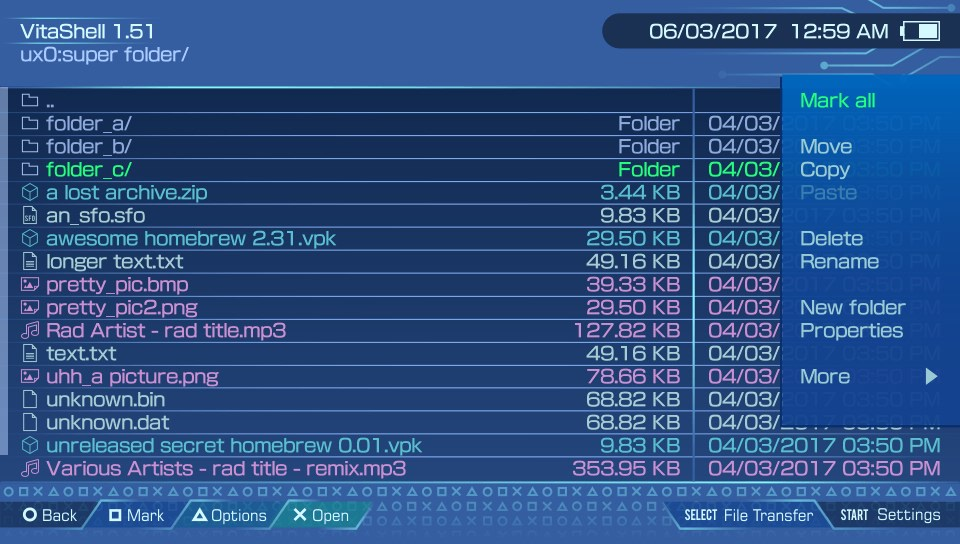

Context Menu More

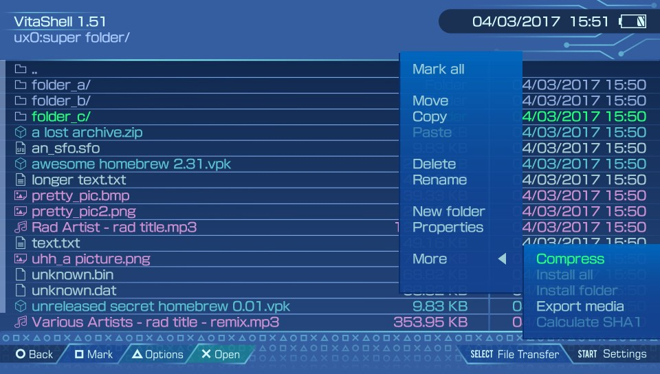

Text Editor

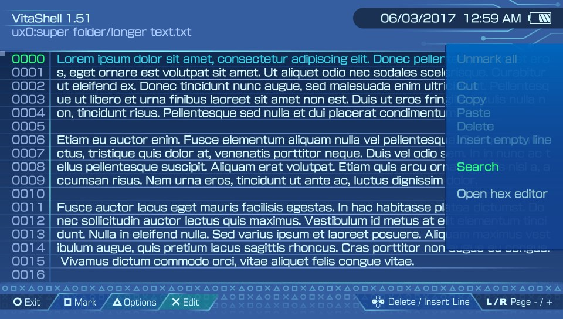

Hex Editor

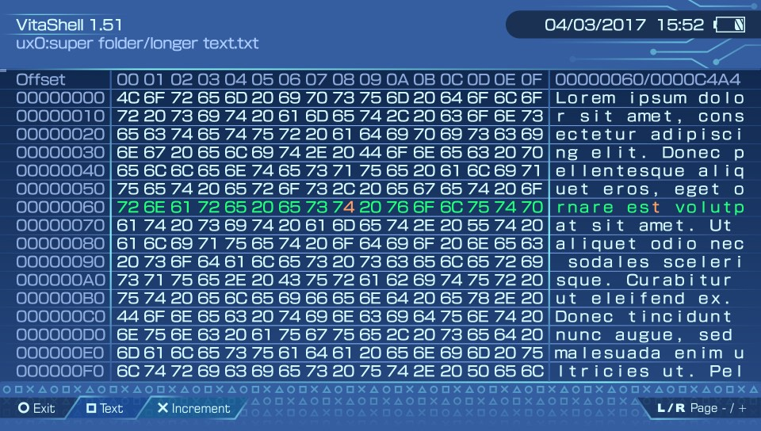

Music Player with Cover

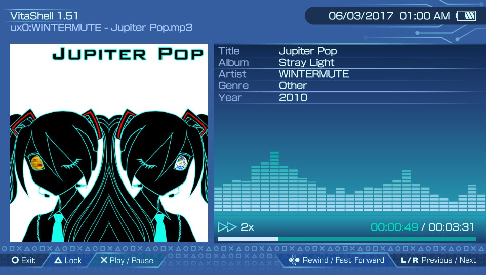

Music Player no Cover

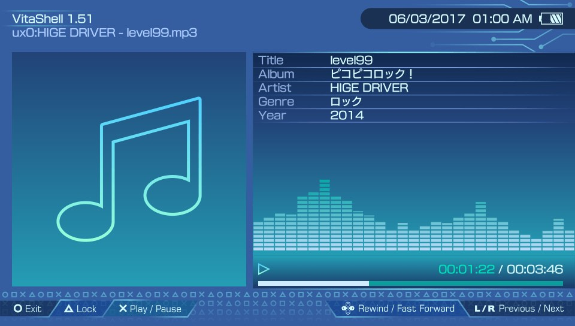

Image Viewer (Image si blurry because of the zoom)

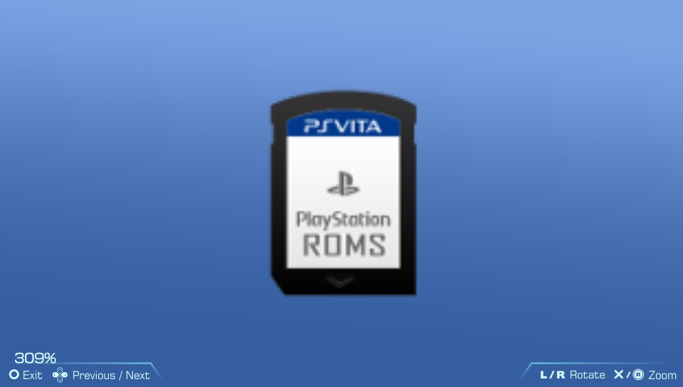

*(obviously, the music visualizer is static)*

## Installation

Simply copy the Electron folder into `ux0:/VitaShell/theme/` and make sure to modify `theme.txt` (in the former directory) to point to the new theme. This is done by changing `THEME_NAME = "Old_theme"` to `THEME_NAME = "Electron"`

Thanks for stopping by and Enjoy :)
