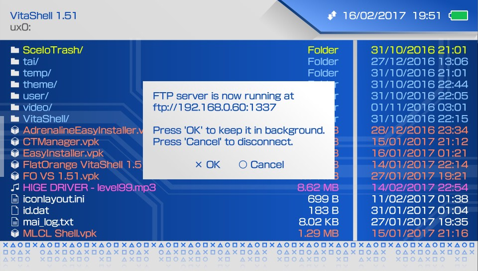

# Acemad's VitaShell Themes Collection
## An assortment of original VitaShell themes.

(Originaly designed for theFlow's VitaShell default theme contest. [Link](http://wololo.net/talk/viewtopic.php?f=116&t=47830&sid=8b890dbb3668cc097cb76f8f8ed849c8))

I believe any theme design should follow these principles to be considered usable, mainly :

- A theme must be unobtrusive.
- A theme should be as clean as possible.
- A theme's color scheme should be easy on the eyes.
- Contrast variations should be clearly justified.
- A theme must be consistent across the differnt views/component.
- If a theme is based on a certain franchise/idea, graphics should be subtle and unobtrusive.

In my attemp to fulfill (more or less of) the above rules, I came up with the following themes :

## Cobalt

## Cobalt Dark

## Electron

## Electron Sky

For more info and screenshots on each theme, please take a look inside specific folders.

PS : Giving an identity to whatever I design is my hobby xD
