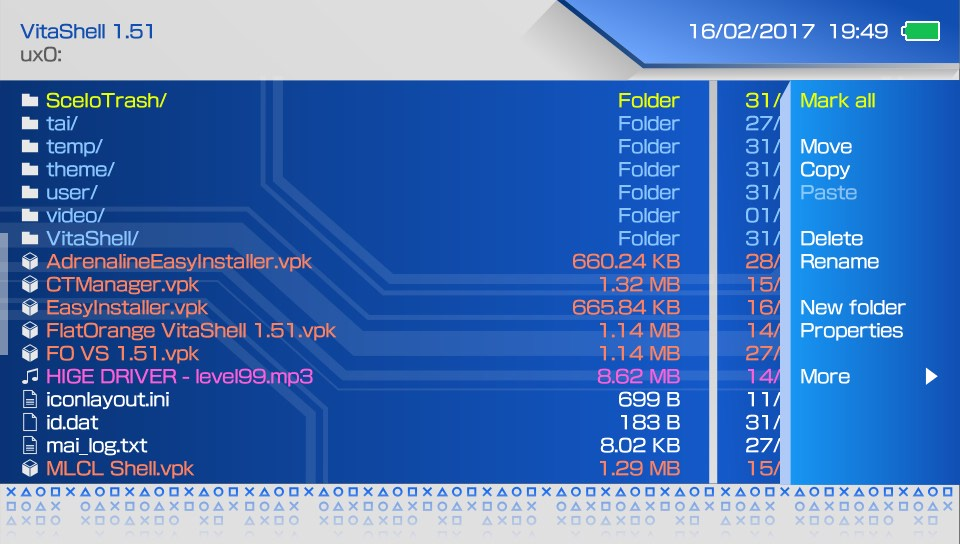
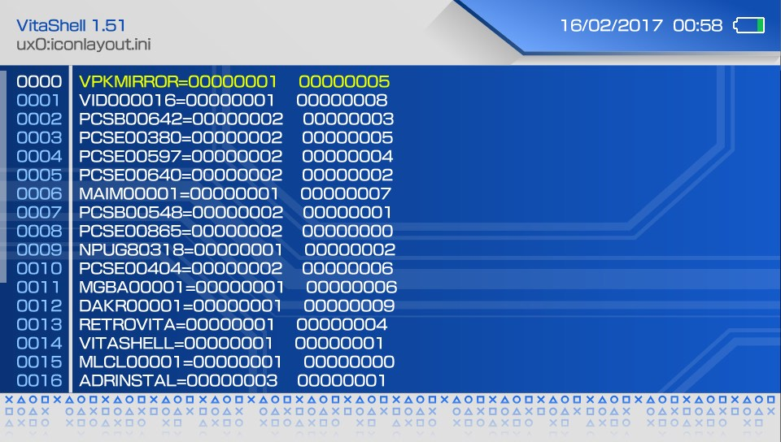
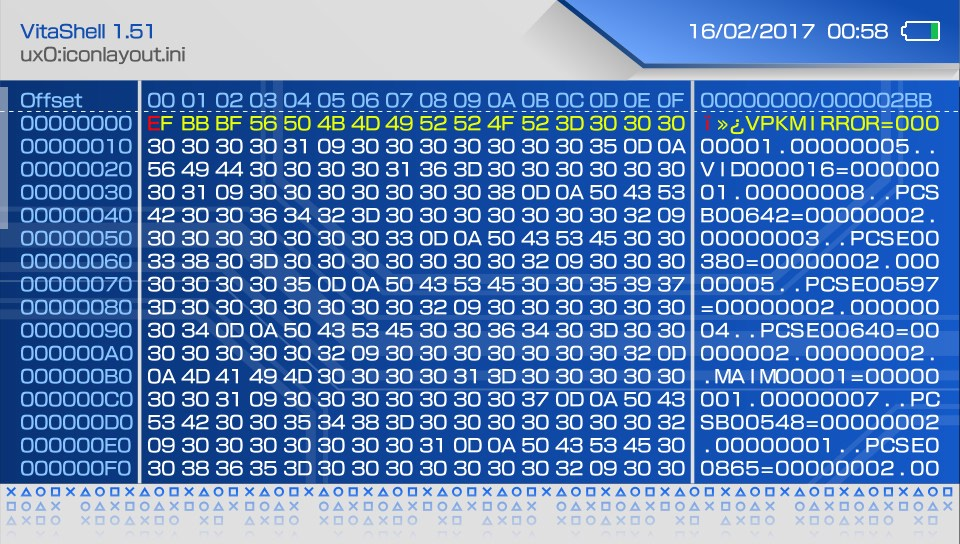
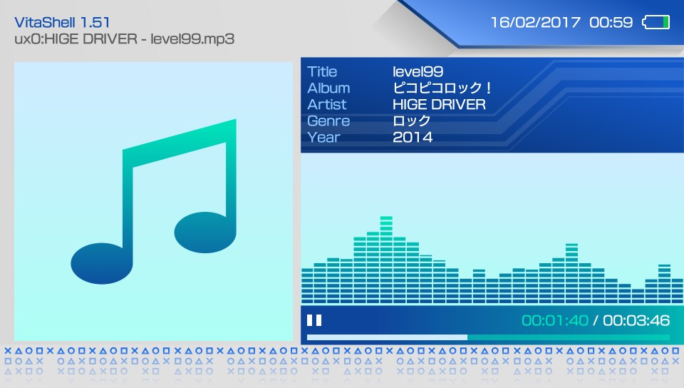

# Cobalt
## A VitaShell Theme

*(Yeah, it has a logo)*

This is my entry to theFlow's VitaShell default theme contest. [Link](http://wololo.net/talk/viewtopic.php?f=116&t=47830&sid=8b890dbb3668cc097cb76f8f8ed849c8)

It's a fairly simple and clean theme with a predominant blue color, nondistractingly influenced by circuit boards with a touch of PlayStation. Highly consitent in every part of VitaShell.
Features redesigned file browser icons and New backgrounds for file browser, text editor, hex editor and music player, plus a prettier context menu and much more subtle changes and refinments.

## Previews

*(obviously, the music visualizer is static)*

## Installation

Simply copy the Cobalt folder into `ux0:/VitaShell/theme/` and make sure to modify `theme.txt` (in the former directory) to point to the new theme. This is done by changing `THEME_NAME = "Old_theme"` to `THEME_NAME = "Cobalt"`

Thanks for stopping by and Enjoy :)

